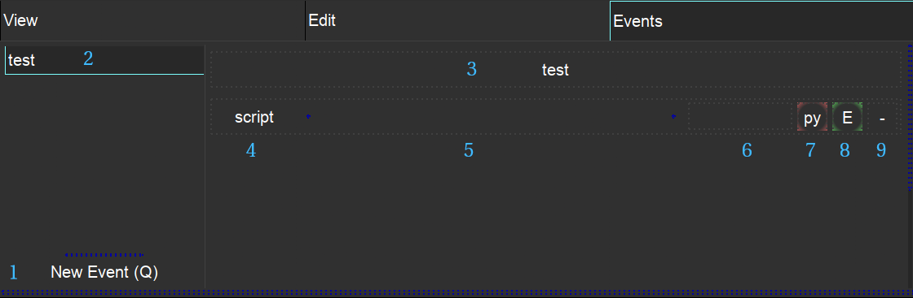

# GSV Manager Tab
The GSVManager Tab is designed to be an all in one place to **modify, view,
edit, and setup python events** for GSVs.  There will be four main sections
of this tab, **view, edit, events**, and a **Python Editor**.

# Tabs

## View
The view portion of this is designed to be the main place for the viewer
to view the current GSVs.  Please note that as of this point in time this
can only be aligned vertically.

## Edit
The **Edit** tab is designed to be the place where the user can create/modify/delete GSVs/Options.
This has two main options **GSV** and **Create Option**.  
  - **GSV**  
        What GSVs options are currently being displayed in the list widget below the options.
        Note that `<variables>` is a special keyword, and will display all of the GSVs in the scene.
  - **Create Option**  
        Creates a new option for the current GSV that is selected in the `GSV` option.  If `GSV` is
        set to `<variable>` then this will create a new GSV.

## **Events**  
The events portion of this tab is where the user can start to setup/design their own custom
events for GSVs.  These events will be triggered when the GSV is changed to the GSV/option designated.

### Events Sections
There are two main sections in this, the event creation section (top) and the Python Editor section
(bottom). These sections can be enlarged to fill the entire space of this widget by using the " **\`** "
key (located above the left tab).  And they can be returned back to the two part displayed by pressing `esc`

### Events Scripts/Files
Scripts are stored on the `Root Node` under the parameter group `KatanaBebop.GSVEventsData.scripts`.

Each script/files local scope will be given two variables `gsv` and `option`:
> gsv (str): name of the GSV being changed  
> option (str): name of the option being changed to

### Events Diagram

1. Button to create new event container for a specific GSV
2. Displays which event/GSV is currently being displayed to the right (also displayed in `3`)
3. Button to create new event for a specific GSVOption.  When you hover over this button, it
    will display the text `Create New Event`
4. Button to toggle between **script** and **file** modes.
5. Name of script, or path on disk to file (depending on mode set in `4`)
6. Select which **option** this event should be run on
7. Display the current script/file in the Python editor below
8. Enabled/Disabled button
9. Delete

## Python Editor
The python editor will look very similar to the normal Katana Python Editor with the exception
that there are two inputs available at the bottom.  A List Input that will allow the user to select
the script/file that you wish to manipulate.  This input is automatically updated when the `py` button
is pressed.  After changes are made to the script, the `save` button needs to be pressed to push these changes
to disk.

# How to use
- To create/modify/delete variables/options use the **Edit Tab**
  - To delete an Option, select it, and press delete
  - To delete a GSV, set the `GSV` to `<variables>`, then select the GSV and delete it
  - To create a new GSV, either type a new name into the `GSV` options box, or set the
    `GSV` options box to `<variables>` and then type a new name into the `Create Option` dialogue.
  - To create a new Option, type a new name into the `Create Option` dialogue
- To change a GSV use the **View Tab**
- To setup a python event